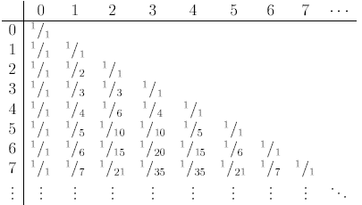
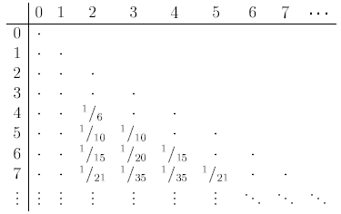
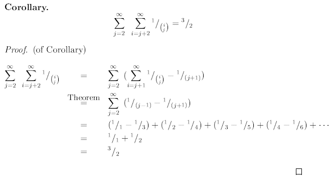
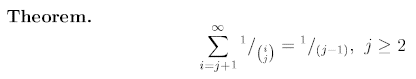

# Sum of Pascal's triangle reciprocals

## Feb 16 2011, tags: xslt triangle reciprocal pascal's sum oeis; 16,545 Views 

Many [binomial identities](https://en.wikipedia.org/wiki/Binomial_theorem) are known, and [Pascal's triangle](https://en.wikipedia.org/wiki/Pascal%27s_triangle) is well known, too.
 
I asked myself back in 1983 at school:  
What is the sum of the reciprocals of Pascal's triangle?

Of course the sum is infinite because of the 1's on left and right border.
 
Next question:  
What is the sum without the 1's?

Of course the sum is infinite again because of the [harmonic series](https://en.wikipedia.org/wiki/Harmonic_series_%28mathematics%29) on left and right border.
 
Final question:  
What is the sum of Pascal's triangle reciprocals without the 1's and without the two harmonic series?

And the answer was (and is) <b>3/2</b> !  

So based on the Theorem further below the Corollary (sum being 3/2) can be prooven pretty easily.  

And here is the main Theorem, a nice decomposition of each [unit fraction](https://en.wikipedia.org/wiki/Unit_fraction) into [binomial coefficient](https://en.wikipedia.org/wiki/Binomial_coefficient) reciprocals.
Starting summation of binomial coefficient reciprocals at row j+1 for column j gives 1/(j-1).

My proof is by [mathematical induction](https://en.wikipedia.org/wiki/Mathematical_induction), two [A4](https://en.wikipedia.org/wiki/A4_paper#The_A_series) pages long and will not be posted here.

It is left as exercise to the reader ;-)  
(or as challenge for one being significantly shorter than two pages).
 

So, why is this posting marked with XSLT tag?
 

Easier to proof it the theorem validity can just be "seen" by actually doing the summations.
Of course these summations are done by a styesheet.
Click on [Pascal.xml](https://stamm-wilbrandt.de/en/blog/Pascal.xml) to compute the sums in your browser (by stylesheet [Pascal.xsl](../res/Pascal.xsl)).  
(interesting what pure HTML allows for in typesetting mathematical formulas itself)  

    $ cat Pascal.xml
    <?xml-stylesheet href="Pascal.xsl" type="text/xsl"?>
    <ctrl>
      <terms>1000</terms>
      <jmax>12</jmax>
    </ctrl>
    $
 

Hermann. 

