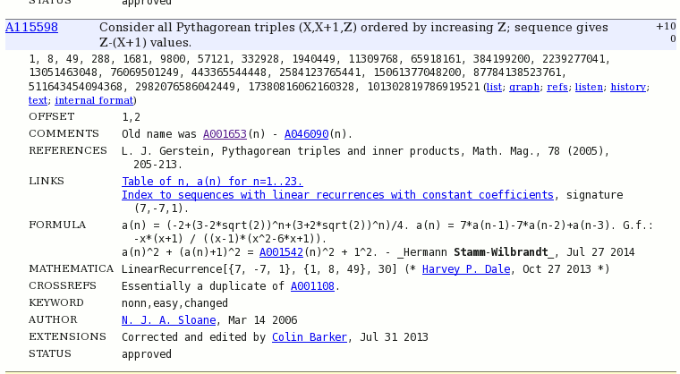
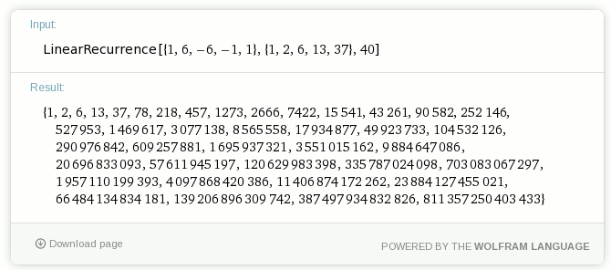
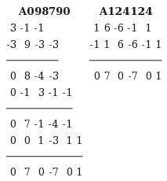

# The On-Line Encyclopedia of Integer Sequences® (OEIS®) gets 50

## July 28 2014, tags: encyclopedia oeis sequence mathematica online wolframalpha integer; 13,703 Views 

The sequence database was begun by Neil J. A. Sloane [in 1964](http://oeis.org/wiki/Welcome#OEIS:_Brief_History) (and is only slightly older than me).

Of course there was no world wide web at that time and the database was not "online".  
The OEIS went online back in 1996.

OEIS contains 245636 integer sequences at the time of writing this post.

So what is OEIS good for?

Say you have a sequence like "1,1,2,3,5,8,13" and want to know what sequences contain that as subsequnce, then you can just query OEIS. You may know that it is the start of so called "Fibonacci numbers", but OEIS does find 123 different sequences containing the given subsequence:  
http://oeis.org/search?q=1%2C1%2C2%2C3%2C5%2C8%2C13&sort=&language=english&go=Search

For a sequence you get comments, references, links, formulas ... (click image for 1:1):
  

I am using OEIS since late 1990s, and started registering&submitting stuff myself beginning of this month:  
http://oeis.org/search?q=Stamm-Wilbrandt&language=english&go=Search

The database is moderated and what I learned quickly by helpful comments of reviewers is that the best way to end any submission is by ". - ~~~~" (dot, space, hyphen, space, 4 tildas). The 4 tildas will be replaced by submitters name and submission date automatically.  
<pre></pre>    

Yesterday I did submit 5 entries and all got approved within hours, but I have seen the review process taking days also (depending on the amount of changes needed for getting approval). I was interested in sequence containing  6,37,218,1273,7422,43261  and did find none. I thought that this might be the first sequence I could submit as author. But then I did a slightly different search, I replaced all the commata by spaces. With spaces in between OEIS will return all sequences containing the query but with 0 to many numbers in between. And in this specific case it did return 2 different sequences:  
https://oeis.org/search?q=6+37+218+1273+7422+43261

As you can see the search sequence is highlighted in bold as every 2nd number in both sequences. Now I got the idea that the odd even position entries of both sequences are the same. I added more terms to the search and repeated, with result confirming:  
https://oeis.org/search?q=1+6+37+218+1273+7422+43261+252146+1469617+8565558+49923733+290976842+1695937321&sort=&language=&go=Search

Now I wanted to confirm that for more entries than listed and stumbled on "MATHEMATICA" entry (this is for 1st sequence):
LinearRecurrence[{1, 6, -6, -1, 1}, {1, 2, 6, 13, 37}, 40]

I know that [Mathematica](https://en.wikipedia.org/wiki/Wolfram_Mathematica) is software for doing mathematical computations, but I neither have it nor know more.

Then I did search Google for "Mathematica online" and to my surprise found WolframAlpha allowing online execution of Mathematica formulas, see this link for the LinearRecurrence statement just mentioned:  
http://www.wolframalpha.com/input/?i=LinearRecurrence[{1%2C+6%2C+-6%2C+-1%2C+1}%2C+{1%2C+2%2C+6%2C+13%2C+37}%2C+40]

OK, to verify that ~~odd~~ even index numbers are the same in both sequences I wanted to "subtract" the 2nd sequence from the 1st sequence element wise. Not knowing whether that works I tried it and to my surprise just works (I did increase number of sequence entries to 100 as well):  
http://www.wolframalpha.com/input/?i=LinearRecurrence[{1%2C+6%2C+-6%2C+-1%2C+1}%2C+{1%2C+2%2C+6%2C+13%2C+37}%2C+100]+-+LinearRecurrence[{3%2C+-1%2C+-1}%2C+{1%2C+2%2C+6}%2C+100]

The ~~odd~~ even position 0s in the result are at least a good indication that odd index numbers in both sequences are the same (of course a proof is needed to be sure about this).

&lt;EDIT date="8/3/2014">

OK, today I did the proof and posted the identity of even index entries for both sequences:  
https://oeis.org/draft/A098790  
https://oeis.org/draft/A124124

And the proof was soooo simple, just making use of the linear recurrence from Mathematica formula.

I knew linear recurrence for the sequence I am interested in (1, 6, 37, 218, 1273, ...), it is:
a(n) = 7*a(n-1) - 7*a(n-2) + a(n-3)

As vector for that is just (7, -7,  1).

So starting with (1, 6, -6, -1, 1) I had just to end at (0, 7, 0, -7, 0, 1) by equivalance transformations for A124124;
and starting with (3, -1, -1) ending at (0, 7, 0, -7, 0, 1) by equivalance transformations for A098790.

And that is as simple as addition and subtraction learned in elementary school.  
  
&lt;/EDIT>  
<pre></pre>
OEIS as well as WolframAlpha are valuable tools for me, and maybe for you, too ...
<pre></pre>

Hermann &lt;myBlog/> [&lt;myTweets/>](https://twitter.com/HermannSW) | [&lt;GraphvizFiddle/>](https://stamm-wilbrandt.de/GraphvizFiddle/) | [&lt;xqib/>](https://stamm-wilbrandt.de/xqib/) | [&lt;myCE/>](http://stamm-wilbrandt.de/ce/) [&lt;myFrameless/>](http://stamm-wilbrandt.de/frameless/)
