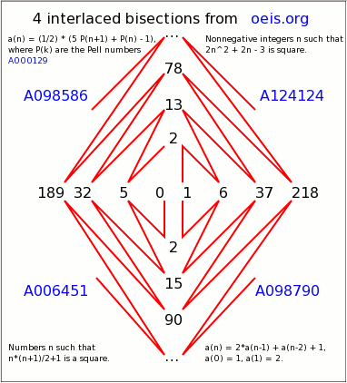

# 4 interlaced bisections from oeis.org 

## Sep 2 2014, tags: oeis bisection svg; 10,917 Views 

  

Above is a SVG only posting, the (blue) links work.  
The SVG source can be found (unmodified by forum software) here:  
http://stamm-wilbrandt.de/en/blog/4ibfo.xml

[the links work only if opening SVG under above link, forum software disables the links]
 

I did test that SVG with FF/Chrome/Opera under Linux and with big5 browsers under Win7.  
Screenshot below just for browsers not capable of displaying SVG.  
I have no idea why now Internet Explorer does not display the posting (it did before).  
So even with Internet Explorer 10 SVG still seems to be unreliable, please open above link.  
 

&lt;Off_topic>  
2 years ago I did nice XSLT SVG and [posted a question](https://www.biglist.com/lists/lists.mulberrytech.com/xsl-list/archives/201202/msg00000.html) on xsl-list.  
I still do like the clickable 3D-animation with mirror:  
http://stamm-wilbrandt.de/en/xsl-list/cube/snake.00.xml  
&lt;/Off_topic>

  

Hermann &lt;myBlog/> [&lt;myTweets/>](https://twitter.com/HermannSW) | [&lt;GraphvizFiddle/>](https://stamm-wilbrandt.de/GraphvizFiddle/) | [&lt;xqib/>](https://stamm-wilbrandt.de/xqib/) | [&lt;myCE/>](http://stamm-wilbrandt.de/ce/) [&lt;myFrameless/>](http://stamm-wilbrandt.de/frameless/) | 
